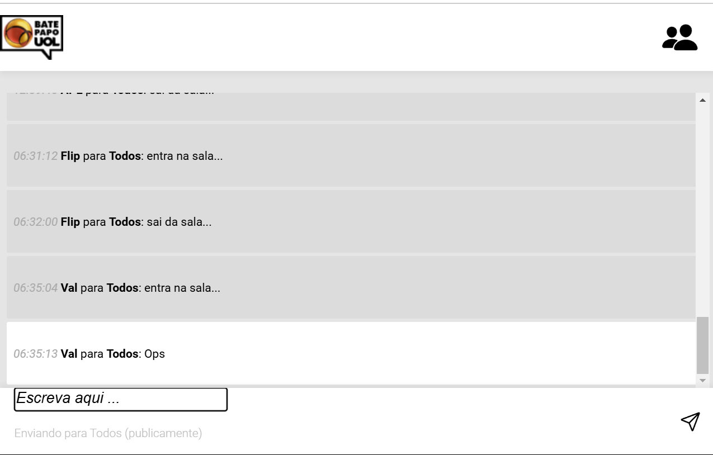

  

# 
Bate-Papo UOL

### 
Tecnologias utilizadas:

   
   
   
   

## 📖 Descrição
Nesse projeto fizemos um aplicativo de bate-papo similar ao saudoso Bate-Papo UOL. Foram utilizadas as seguintes tecnologias: HTML, CSS, JavaScript e requisições axios.
Esse tipo de aplicação possibilita que pessoas de todos os lugares se encontrem, se conectem e construam amizades e relacionamentos significativos.
Para fazer uso do aplicativo o usuário deverá fazer login (informando um nome de usuário) e na próxima tela que se abre escolher se deseja enviar mensagens para particulares ou para todos (pública).

## 📋 Pré-requisitos
Para desenvolver esse projeto foi preciso lançar mãos de uma API (Interface de Programação de Aplicações), a qual possibilita fazer requisições de envio e recebimento de mensagens em tempo real.

## 🚀 Instalação
Baixe o repositório do projeto no github e execute em sua máquina. Ou se preferir, acesse o aplicativo online no link abaixo:

💬 [**Acesse aqui**](https://fabianorsdantas.github.io/Bate_Papo_UOL/)

## 💻 Prévia

$~$

[🔝 De volta ao topo](#bate-papo-uol)

